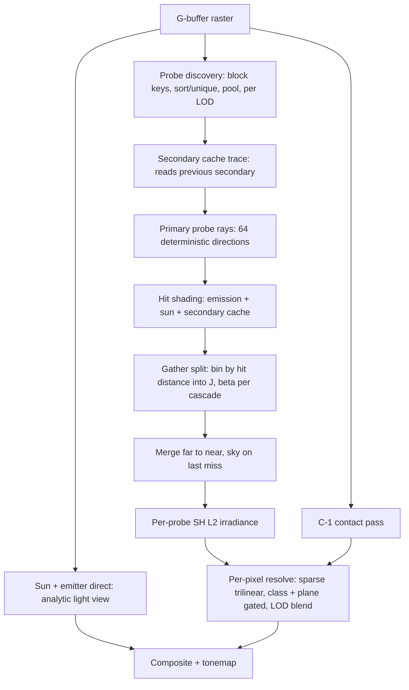

# World-Space Radiance Cascades on an Inverted Rasterizer

Target: fully dynamic diffuse GI + direct sun shadows, **no TAA, no denoisers, no
lighting accumulation for the first bounce**, on an **RTX 3060 Laptop**. Lights:
sun (directional, no CSM) and emissive mesh lights. No shadow maps, no stochastic
sampling, no hardware ray tracing.

This is a rewrite of a plan that assumed a Vulkan `VK_KHR_ray_query` backend. The
architecture is kept almost intact — it is the right architecture. What changes is
the tracer: example 41 already has one, it is measured, and it removes an entire
milestone. §3 is the substitution and §5 is honest about what it costs.

---

## 0. What the sources actually tell us

### Sannikov, *Radiance Cascades* (2023 preprint) & Osborne–Sannikov (2024, arXiv 2408.14425)

- **Penumbra hypothesis**: to resolve light from an interval `[a, b]` you need
  spatial spacing ~`a` and angular spacing ~`1/b`. Near field wants dense probes
  and few directions; far field wants sparse probes and many directions.
- Radiance intervals store `(J, β)` — radiance and transmittance over
  `[t_{n-1}, t_n]` — merged back-to-front exactly like premultiplied-alpha
  compositing (eq. 10/11). Fractional `β` is valid and useful for alpha-tested
  foliage.
- Cascade `i` scales as `Δs ∝ 2^i`, `Δω ∝ 1/2^(αi)`, `t_i ∝ 2^(αi)`, with `α ≥ 1`
  the branching factor; the paper uses `α = 2`.
- Full 3D grids cost memory proportional to cascade 0 — prohibitive as a dense
  volume. The paper explicitly names *screen-space probes with world-space
  intervals* as the direction that removes the limitation, at a higher constant.
- Admitted artefacts: **ringing** around bright sources (~10% worst case) from
  parallax between a cascade-`i` probe and the cascade-`i+1` probes it
  interpolates; **light leaking**, which the paper says "is typically an
  indication that the penumbra criterion is violated". The **bilinear fix** (trace
  each interval from the child interval's start position on each interpolated
  parent probe) addresses both, at 4× the rays in 2D.
- Known failure mode: small, bright, point-like sources break the hypothesis.

### Freeman & Sannikov, *Split Radiance Cascades* (arXiv 2607.20384, Jul 2026)

- **Sparse hashmap** of world-space probes, allocated only near visible surfaces;
  nearest `c_n` probe per visible point; **sparse trilinear** with renormalisation.
- **LODs**: probe spacing doubles per LOD, chosen by Chebyshev distance to camera,
  keeping on-screen probe size constant. LODs overlap by 0.9 and blend.
- **Ray splitting**: one ray from a visible surface is split by hit distance into
  all cascades (`J=0, β=1` below the hit interval, `J=L, β=0` at it, nothing
  above). Removes recessed-probe darkening and **divides tracing cost by the
  cascade count**.
- Recommended parameters: `K = 4` (directions ×4 per cascade), `l = 4` (ray length
  ×4 per cascade), 32 c0 directions, `t0 ≈ 1.6 Δs0`, `N = 4`. Equal-area sphere
  mapping beat octahedral.
- R2 low-discrepancy directions with a hierarchical prefix sum so every cascade's
  bins get covered; **temporal jitter** spreads residual error.
- Irradiance per probe baked to 6×6 octahedral; ≤8 filtered taps per pixel.
- Multibounce via a **secondary cache** at ray hit points (2 LODs coarser), fed
  from the previous frame.
- **C(−1)**: a screen-space short cascade below c0 to recover detail smaller than
  probe spacing.
- Timings on an RTX 3080 Laptop: 8.6 ms (Sponza) / 11.5 ms (San Miguel), of which
  trace 1.3/4.5 ms, deposit 2.2/1.9 ms, shade 2.5/2.4 ms. Stated weaknesses: leaks
  through geometry thinner than probe spacing, over-blurred hard shadows, 4× ray
  count variance between near and far probes of the same LOD.

### Blackline Interactive / Lucida — treat as an existence proof, not a blueprint

World-probe GI, no TAA/denoiser, Bistro at 60 fps and ~7.4–9.9 ms on a Radeon Pro
5500M with no RT hardware; 720p vs 2K differs by ~7 fps because cost scales with
probes, not pixels.

**The public repository does not contain this pipeline.** Verified directly at
`1d201a0`: `render_radiance_cascades/rc_shader.metal` is a single per-pixel kernel
over spheres/planes/cubes with a fixed weighted sum of four distance shells — no
probes, no merge, no triangles. The mesh path in `render_metal` computes
`sky_irradiance(bent_normal) * ao * 0.6`; `trace_gi` calls `any_hit_instances`,
which returns a bool, so emissive meshes cannot illuminate anything, and no C++ in
the tree derives a `GPULight` from an emissive material. Whatever produces the
video numbers is unpublished. The figures are worth having as evidence that the
target is reachable; nothing about *how* can be taken from them.

### Our own measurements — the numbers this document is costed against

RTX 3060 Laptop, example 41, Bistro (4 208 958 triangles, 76 248 emissive, 2909
instances), 512², one bounce, emitters through the raster:

| what | result |
|---|---|
| geometry scaling (finding 46) | 16× the triangles costs **1.27×** the triangle fetches |
| surviving triangles per texel | **570** on Bistro, 289 on Sponza, 62.6 on Cornell+bunny |
| cost vs directions per probe (finding 47) | res 8 (64 dirs) **670.6 ms/sweep**; res 16 (256) 5623.2; res 32 (1024) 17164.4 |
| cost vs box-test count (finding 47) | 8.5× fewer group tests changes the time by **0%** |
| current default | 5623 ms/sweep = 2814 ms/frame |

Two of these are load-bearing. **Texels are the lever and box tests are not** —
this kernel is occupancy/latency bound, so removing arithmetic does nothing while
removing directions does a lot. And **64 directions per probe is already measured
at 670 ms/sweep**, which is the number §5 builds on.

---

## 1. Design principles

1. **Probe-anchored, deterministic rays.** Rays originate from probes on fixed,
   world-locked direction sets. A static scene produces bit-identical frames; a
   moving camera re-randomises nothing. This is what makes "no TAA, no denoiser"
   viable rather than aspirational.
2. **One ray feeds every cascade.** Ray splitting is the cost structure of the
   whole design, not an optimisation bolted on.
3. **Gather, never scatter.** A fixed ray budget per probe with a deterministic
   layout means every ray's destination bin is known in advance — no atomic hash
   writes. Example 41's `gather.comp` is already built this way and the invariant
   ("index identity is a pure function of the schedule") is load-bearing there.
4. **Leak prevention is structural**, not a post-filter: probe identity includes
   surface orientation, and interpolation is plane-gated.
5. **Direct sun is not an RC problem.** A 0.5° source violates the penumbra
   hypothesis. It keeps example 41's analytic light view. This is finding 4's mass
   split arriving from the other direction: the direct term's error is *not*
   correlated across neighbouring receivers, so it must not be shared, while the
   smooth remainder tolerates exactly the sharing RC does.
6. **The tracer is a component, not the architecture.** §3 uses the one that
   exists. If it becomes the bottleneck, it is replaced without touching anything
   above it.

---

## 2. Frame pipeline



### 2.1 G-buffer

Depth, **geometric** normal (for probe classification), shading normal, albedo,
emissive, instance ID. No motion vectors — there is no temporal pass to feed.
Example 41's `screen.cpp` already produces all of this.

### 2.2 Direct sun and emitters

Unchanged from example 41. The sun cone and the per-emitter light view
(`lightview.glsl`) are analytic, deterministic, and already gated. Two notes:

- The light view is `O(receivers × emitters)` with a scene traversal inside the
  loop (`direct_pixel.comp:242`). At Bistro's 76 248 emitters it cannot be used,
  and it is not needed: **emissive meshes are an RC input, not a direct-lighting
  input** (§2.7). The analytic path stays for the sun and for scenes with few,
  large emitters where it is exact and cheap.
- No shadow maps and no CSM anywhere. Sun visibility is one traversal against the
  same geometry everything else uses.

### 2.3 Probe discovery (sparse, world-locked, screen-discovered)

Dense volumetric probes are not affordable and the arithmetic is not close. At a
cascade-0 spacing taken from today's grid, a dense grid `(D/√3 / Δs0)³` is **5.2e5
probes on Cornell (70× today's camera count) and 1.9e7 on Bistro (2600×)**; even
sparse surface-adjacent allocation `A/Δs0²` is 61× on Bistro. Surface area is a
scene property and probe budget is not. Split RC's answer is the only one that
survives, and it is the one this document uses: **discover probes from the screen,
store them in world space.**

- Per **4×4 pixel block** (low tier: 8×8), take the depth sample nearest the block
  centre → world position `x`, geometric normal `n`. Point-sampled, never
  averaged: `place.comp:14-19` already argues why — a position averaged across a
  depth discontinuity describes a surface that is not there.
- **Normal class**: dominant axis of `n` → 6 classes (±X, ±Y, ±Z). Pixels within
  ~10° of a boundary emit keys for both classes, which removes seams on curved
  surfaces.
- **LOD** = `floor(log2(chebyshev(x − cam) / D0))`, ±0.1 hysteresis. This is what
  makes cost resolution-independent: probe footprint is constant in screen space.
- **Key** (64-bit): `LOD (5) | class (3) | cell x,y,z (18 each)`, cell =
  `floor(x / Δs0_LOD)`. **Two sides of a thin wall share a cell but have opposite
  classes, so they are different probes.** This is the single most valuable idea in
  the design and it costs three bits.
- Unique-ify with a GPU radix sort + adjacent-unique — deterministic, no atomics.
  Parents for c1..c(N−1) via `cell >> n`, same class and LOD, sorted and
  unique-ified in turn. Example 39's `PrefixSum` (`examples/39_mosaic/gpu_util`) is
  the existing building block.
- **Persistent probe pool**: stable slot per key across frames. **Only allocation
  and anchors persist — no lighting history.**
- **Anchor**: per c0 probe, the surface point and geometric normal nearest the cell
  centre. Ray origins are `anchor + n·ε`, which is what removes recessed-probe
  darkening. Re-anchor every frame for dynamic instances; kill probes whose anchor
  leaves the cell.

### 2.4 Deterministic hierarchical direction assignment

**The core novelty, and the most likely thing to fail. Validate it before anything
else is built on top.**

Goal: a fixed budget of `D0` rays per c0 probe such that the rays of all children
of a `c_n` probe together cover every one of that probe's `D0·4ⁿ` direction bins,
with zero per-frame randomness.

- Directions are hemi-octahedral in the class frame at `res 8` (`D0 = 64`).
  **Deviation from Split RC, which found equal-area sphere mapping beat
  octahedral**: example 41 has a verified quadrature table for exactly this map
  (`Quadrature::build`, asserted to `Σ cos·dΩ = π` at startup and by gate 1), and
  hemi-oct gives the cascade nesting *for free* — a `2×2` texel block at `res 2r`
  is exactly one texel at `res r`, which is the parent/child relation §2.5 needs.
  Equal-area would require building that relation by hand. Revisit if the
  non-uniform solid angle shows up in the c0 error.
- For c0 probe `p` and bin `d`, choose a sub-bin at the top cascade from base-4
  digits: `digit_k(p)` = the 2-bit child slot of `p`'s ancestor at level `k`, taken
  from the cell offset along the two **tangent** axes of the class (the normal axis
  is ignored, so a flat surface yields exactly 4 children per parent). Apply a
  fixed per-`(d, k)` Owen-style scramble to break alignment.
- On flat regions this is exact stratified coverage. On diagonal and foliage
  regions collisions leave bins empty; the merge renormalises over filled bins and
  falls back to the parent bin value.
- Total primary rays = `#c0 probes × 64`, **independent of resolution and of
  cascade count**.

**The risk, stated where it will be looked for:** collisions produce *structured*
error, not noise. Structured error with no TAA is the artifact class this whole
project exists to avoid. The gate below is not optional.

> **Gate 4 (hard):** empty-bin heatmap per cascade under 5% on Bistro — not on a
> test box. Cornell cannot show this; its geometry is six planes.

### 2.5 Trace and hit shading

Each ray is traced **once**, to `t_{N−1}`. At the hit, outgoing diffuse radiance is

- `emission` (low-mip emissive texture — stable and cheap), plus
- `albedo/π · E_sun · visibility` — one sun visibility trace from the hit, and
- `albedo · E_indirect` from the secondary cache (§2.8).

Backfaces of closed meshes mean the ray started inside: `β = 0, J = 0`. Two-sided
cards shade the side facing the ray. Alpha-tested geometry gets an exact test in
the c0–c1 range and may use a stored average coverage as fractional `β` beyond
that — valid under the merge equation and much cheaper.

### 2.6 Gather split and merge

Because the ray index `(probe, bin)` is fixed, building interval data is a gather.

- c0 bin value = the single ray, split by hit distance: a hit at
  `t ∈ (t_{n−1}, t_n]` writes `(J = L, β = 0)` to cascade `n` and `β = 1` to every
  cascade below it.
- `c_n` bin `(q, b)` = the average over child rays that selected `b`, known
  analytically from the digit scheme, counting only rays whose interval information
  reaches cascade `n`.
- Soft interval edges: `β = smoothstep` over the last ~15% of each interval, to
  suppress the ring artefact the papers describe.

Merge far to near:

```
I_n = J_n + β_n · mean( Interp(I_{n+1}) over the 4 child directions )
```

`Interp` is sparse trilinear over same-LOD, **same-class** probes, with weights
multiplied by a **plane gate**

```
w *= saturate( 1 − max(0, −dot(n_anchor_q, x_p − anchor_q)) / (0.5 Δs) )
```

so a probe behind another probe's surface cannot contribute, and renormalised over
the survivors. Last-cascade misses sample the sky **with the sun disk removed** —
the sun arrives only through §2.2.

**β is binary here**, because this tracer produces exact occlusion rather than a
marched density: a shell either found a triangle or it did not. The two-vector
collapses to `(vec3 radiance, 1 bit)` and the merge becomes a select. Fractional β
stays reachable for alpha-tested foliage, which is the case it exists for.

### 2.7 Emissive mesh lights

Handled natively: rays that hit emissive surfaces carry emission, and RC resolves
area-light penumbras well. This is the path Bistro needs — 76 248 emissive
triangles are ordinary geometry here, with no light list and no per-emitter loop.

The weakness is the papers' own: a small, very bright emitter far from a probe
falls between angular bins. Mitigations in order — content guidance on minimum
emitter solid angle; **emitter-guided rays** (each c0 probe traces 1–2 deterministic
rays toward the bounding sphere of each of the top-K emissive instances by flux,
deposited into the correct bin with a solid-angle correction); and merging coplanar
adjacent emitter triangles, which is worth ~20% of the direct pass on Cornell and
is already on example 41's list.

### 2.8 Multi-bounce (secondary cache)

- Keys come from the **previous frame's** primary hit points, LOD + 2, same class
  and anchor machinery, roughly 1/16 the probes.
- Order per frame: trace the secondary cache first (its hits read the *previous*
  secondary), then primary hits read the *current* secondary.
- Bounce 1 and bounce 2 are same-frame; bounce `k ≥ 3` lags `k−2` frames. The cache
  is **replaced** each frame, never blended, so there is no exponential tail and no
  ghosting — switching a light off makes it disappear bounce by bounce over a few
  frames.
- Clamp GI albedo ≤ 0.9 to guarantee convergence.
- Misses (first frame after an off-screen disocclusion) fall back to a coarse
  far-field term; log the miss rate rather than hiding it.

This is the one place the design is not strictly single-frame, and it is a
deliberate choice: bounce 1 is exact and fresh every frame, which is what "final at
frame one" has to mean for this project.

### 2.9 Irradiance and pixel resolve

- Per c0 probe, project merged hemisphere radiance to **SH L2** (27 floats). For
  Lambertian irradiance this is not a compromise — irradiance is inherently
  low-order — and it avoids an octahedral border pass.
- Per pixel: up to 8 neighbouring probes of the same LOD, class(es) and plane gate;
  evaluate SH at the shading normal; renormalise; blend overlapping LODs.
- **C(−1)**: a screen-space HiZ march of length `t0` along ~4 fixed directions per
  pixel, used as an occlusion factor on c0. This restores contact detail below
  `Δs0`. It is the one screen-space component in the design and it is deliberately
  the weakest kind — an AO-like scalar, not a light source.

### 2.10 Composite

`final = emissive + direct_sun + albedo · (E_RC · C(−1))`. No temporal filters
anywhere.

---

## 3. The tracer

This is the section that replaces the Vulkan RT backend, and the argument for it is
that it already exists, is validated by 36 gates against a CPU ray-cast oracle, and
is measured on the target scene and GPU.

### 3.1 What example 41's rasterizer already is

`mbg_resolve_vis_coop` takes a world position and a hemi-octahedral target and
resolves, for every texel, which triangle is nearest along that texel's direction.
One workgroup of 64 threads per probe; all 64 walk the same super-group, group and
cluster lists while each carries its own texels and its own distance bound.
Mathematically it is ray–triangle intersection. Architecturally there is no BVH, no
per-ray state, and no stack — the nearest hit is a register comparison.

That is precisely "trace `D0` deterministic directions from one origin", which is
the only tracing operation this architecture performs.

### 3.2 What has to change, and it is small

1. **Emit the hit distance.** `s_vis[i] = best[k]` stores the winning triangle
   index; the distance is already computed and lives in `bd[k]`. Ray splitting is
   binning a number the tracer has and currently discards. This is the first code
   change and the first measurement.
2. **A probe origin with no tangent plane.** `mbg_set_receiver` builds a frame from
   a surface normal and `mbg_cull` rejects clusters below the tangent plane. c0
   probes are anchored on surfaces and keep both. Higher cascades are not traced
   independently (§2.4), so no full-sphere probe origin is required — which removes
   the hemi-to-sphere seam an earlier draft of this plan had to design around.
3. **Per-probe direction frames.** Finding 14 rotates every receiver's tangent
   frame by a hash of its position, because a globally identical direction set
   *bands*. A probe is shared, so the rotation becomes per-probe — and §2.4's
   scramble is the mechanism that keeps neighbouring probes from aligning.

### 3.3 What it costs, without flattering it

Per ray, this tracer is slow. Bistro at res 8 is 670.6 ms per sweep for 4.73e5
texels — **1.42 µs per ray, about 700k rays/s.** Hardware RT on this class of GPU
is three orders of magnitude faster per ray, and the reason is visible in the
counters: a texel fetches **570 triangles**, where a BVH would visit a few dozen
nodes. Finding 46's result that 16× the geometry costs only 1.27× the fetches says
the *hierarchy scales*; it does not say the constant is good.

So the honest position is: **this tracer is chosen because it makes the
architecture testable now, against an oracle that already exists, without a
backend rewrite — not because it is fast.** §5 sizes the gap and §7 puts the
replacement where it belongs.

---

## 4. Leak and thin-geometry strategy

| Leak source | Countermeasure |
|---|---|
| Probe cell spans both sides of a thin wall | Normal class in the probe key → separate probes per side |
| Trilinear pulls probes through geometry | Plane gate on the anchor, same-class only, renormalised sparse weights |
| Probe centre recessed inside a mesh | Rays from persistent surface anchors, not cell centres |
| Rays starting inside closed geometry | Backface hit → `β = 0` |
| Detail smaller than `Δs0` | C(−1) screen-space contact term; smaller `Δs0` on the high tier |
| Interval boundary rings | `l = 4` scaling, `smoothstep` β at interval edges, bilinear fix if needed |
| Sun bleeding through thin walls | The sun never enters RC; explicit visibility only |
| Class seams on curved surfaces | Dual-class keys near class boundaries |
| Parallax between cascade `i` and `i+1` probes | The papers' bilinear fix — 4× rays on every cascade but the last; adopt only if the ring gate fails |

Osborne & Sannikov's diagnosis is worth keeping in view: leaking "is typically an
indication that the penumbra criterion is violated" — usually `Δs0` too large for
the occluder. The first response to a leak is to check the criterion, not to add a
filter.

---

## 5. Budgets, grounded in measurement

Everything here is derived from §0's measured table rather than from a fit.

**Ray count.** `#c0 probes × 64`, for all cascades, at any output resolution.

**Measured anchor.** 7396 probes × 64 directions = 4.73e5 traversals = **670.6 ms
per sweep** on Bistro, 4.2M triangles, an RTX 3060 Laptop. Against today's default
of 5623 ms for a single unbounded res-16 hemisphere per receiver, that is **8.4×**
— and it delivers the whole cascade hierarchy rather than one bounce of one shell.

| | Bistro 512², today | Ray-split cascades, same probe count |
|---|---|---|
| traversals per sweep | 1.89e6 | **4.73e5** |
| ms per sweep | 5623 | **670** |
| what it produces | one hemisphere, one bounce | c0..c4 for the full ladder |

**And it is still not a frame budget.** 670 ms per sweep is 335 ms per frame. The
target is ≤5 ms. The remaining ~70× has exactly three plausible sources, and they
should be attacked in this order:

1. **Fewer probes.** The 7396 above is today's screen grid at `scale 6`. A constant
   8–16 px probe footprint with LODs (§2.3) is what the design actually calls for,
   and at 512² that is ~1–4k c0 probes. **2–7×**, and it is the change that also
   buys resolution independence.
2. **Fewer triangles per ray.** 570 fetches per texel is the whole gap between this
   tracer and a real one. This is where a BVH, or hardware RT, or a better cull
   belongs — and note finding 47: box tests are free on this kernel, so a cheaper
   *traversal* does not help; only fetching fewer triangles does.
3. **Occupancy.** Findings 38/39/42/44 all moved the clock by giving back shared
   memory. A 64-direction c0 needs a quarter of the `s_vis`/`s_cdf` that res 16
   does, which should buy occupancy directly. Unmeasured.

Memory: per-cascade storage is roughly constant (¼ the probes × 4× the directions),
so total ≈ `N ×` cascade 0. At 64 bins × 8 bytes (RGB half + β) ≈ 512 B per c0 probe
per cascade; at 4k probes and `N = 5` that is ~10 MB, plus merged and SH buffers.
Memory is not a constraint at this probe count.

---

## 6. Validation

The decisive advantage of building this inside the existing repo: **the reference
already exists.** No milestone is spent constructing one.

- **Oracle**: example 41, frozen. 36 gates, RMSE 0.0430 / 0.0374 against
  path-traced references, and `Solver::solve_points` places a camera at an
  arbitrary point and integrates exactly. Every cascade result is checkable against
  the same scene, camera and references.
- **Interval identity** (before any spatial interpolation exists): merging
  contiguous intervals along one ray from one origin must reproduce the unsplit
  trace **bitwise**. This validates the split and the merge operator on their own.
- **Stability**: static camera → frames bit-identical. This is a hard gate, not a
  metric.
- **The image, not just RMSE**: `MBG_INDIRECT_ONLY=1 MBG_EXPOSURE=4`, the method
  `camera-reuse.md` §3 used to overturn a monotone RMSE table. RMSE against the
  composite is dominated by the per-pixel direct term and is structurally blind to
  the correlated blotching that finding 4 is about.
- **Adversarial scenes**: Cornell with a single-sided thin partition; dense
  foliage; a small bright emissive; a door opening into a dark room (bounce
  latency). Bistro is the leak and emitter scene; Cornell is the quality oracle;
  Sponza and Bistro are the timing scenes.
- **Measurement discipline**: bounded `MBG_BENCH` runs batched into one command,
  state what is being measured before starting, stop at the first clear answer,
  ~10% run-to-run variance — do not chase sub-10% effects with repeats.

---

## 7. Milestones

The Vulkan backend, the BLAS/skinning work and the reference path tracer are all
deleted from the original plan. What was milestone 1 is already in the repo.

1. **Hit distance out of the tracer, and the interval identity gate.** Write `bd[k]`
   alongside `s_vis`, bin by distance, merge, assert bitwise equality against the
   unsplit trace. *Gate: 0 disagreements; existing 36 gates bit-identical.*
2. **Dense cascades in a small box** — no hash, no LOD, fixed probe grid in Cornell.
   Validate intervals, merge, sky handling and energy against the oracle.
   *Gate: RMSE no worse than 0.0374/0.0430, and the 4×-exposure indirect image shows
   no structure the current scale-6 image does not.*
3. **Sparse probes**: block keys, sort/unique, persistent pool, LODs, normal
   classes, anchors, plane gating. *Gate: leak test on the thin-partition scene.*
4. **Deterministic direction assignment + gather split.** *Gate: empty-bin heatmap
   per cascade < 5% on Bistro.* **This is the novelty; if it fails, the design
   falls back to per-cascade tracing and the cost model in §5 collapses to ~1.6×,
   at which point the project should stop.*
5. **SH resolve, C(−1), LOD blending.** *Gate: resolution independence — 512² vs
   1600×900 within 15%.*
6. **Secondary cache multibounce.** Energy vs the oracle after 1, 2, 4 bounces.
7. **Tracer replacement, if and only if §5's items 1 and 3 have been exhausted.**
   This is where a BVH belongs — and note that finding 42 reverted one twice, so it
   arrives as a swap behind the §3 interface, measured against the tracer it
   replaces, not as a rewrite.
8. **Emissive robustness**: emitter-guided rays, coplanar emitter merging.

---

## 8. Risks

- **Direction-assignment collisions in 3D clutter** (§2.4) — the load-bearing
  novelty, and the failure mode is structured error, which is the one kind this
  project cannot filter away. Gate 4 exists for this and runs on Bistro.
- **Tracer throughput** — 1.42 µs per ray is three orders of magnitude off hardware
  RT. §5 says where the 70× has to come from; if items 1 and 3 give less than ~10×
  between them, milestone 7 becomes mandatory rather than optional.
- **Shared probes versus finding 14.** A probe is shared by construction, so the
  per-receiver rotation that decorrelates quadrature error cannot survive at
  cascades ≥1. The claim that the far field is low-frequency enough not to need it
  is *plausible reasoning of exactly the kind `camera-reuse.md` §4 recorded and §5
  then had to revise.* Do not bet on it; measure it at milestone 2.
- **LOD transitions while moving** — hysteresis and overlap blending, but there is
  no TAA to hide a pop.
- **Small bright emitters** — an inherent RC limitation, mitigated but not removed.
- **My own cost predictions in this codebase have been wrong twice** (a 13× that
  evaporated under scrutiny; finding 46's two-point fit, which finding 47 refuted
  with an 8.5× work reduction that changed the clock by 0%). Every number in §5 is
  either measured and cited or labelled as an inference. Treat the inferences
  accordingly.
